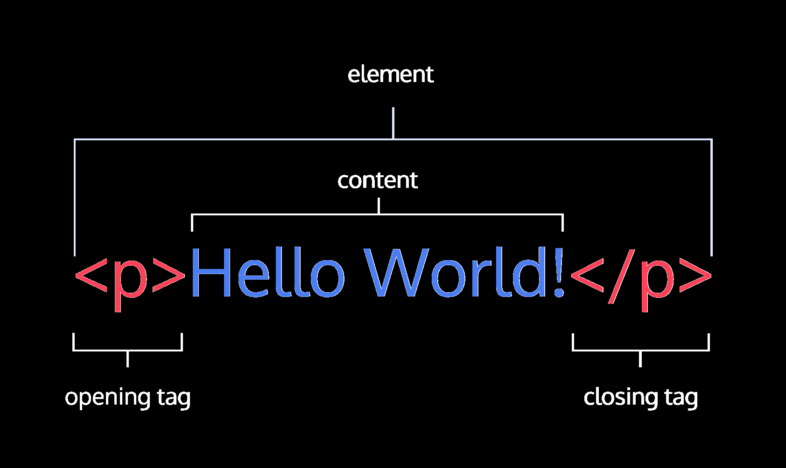

# HTML

## O que é?

HTML significa linguagem de marcação de hipertexto:

Uma linguagem de marcação é uma linguagem de computador que define a estrutura e a apresentação do texto bruto.
Em HTML, o computador pode interpretar texto bruto agrupado em elementos HTML.
Hipertexto é um texto exibido em um computador ou dispositivo que fornece acesso a outro texto por meio de links, também conhecidos como hiperlinks.

## Anatomia

HTML é composto de elementos. Esses elementos estruturam a página web e definem seu conteúdo. Vamos dar uma olhada em como eles estão escritos.

O diagrama à seguir exibe um elemento de parágrafo HTML:

Como podemos ver, o elemento parágrafo é composto por:

- Uma tag de abertura `
`
- O conteúdo texto `Olá, mundo!`
- Uma tag de fechamento `
`

Uma tag e o conteúdo entre ela são chamados de elemento HTML. Existem muitas tags que podemos usar para organizar e exibir texto e outros tipos de conteúdo, como imagens.

Vamos revisar rapidamente cada parte do elemento retratado:

Elemento HTML (ou simplesmente elemento) — uma unidade de conteúdo em um documento HTML formada por tags HTML e o texto ou mídia que ele contém.

Tag HTML - o nome do elemento, rodeado por um colchete angular de abertura (<) e fechamento (>).

Tag de abertura — a primeira tag HTML usada para iniciar um elemento HTML. O tipo de tag é cercado por colchetes angulares de abertura e fechamento.

Conteúdo — As informações (texto ou outros elementos) contidas entre as tags de abertura e fechamento de um elemento HTML.

Tag de fechamento — a segunda tag HTML usada para finalizar um elemento HTML. Tags de fechamento têm uma barra (/) dentro delas, logo após o colchete angular esquerdo.
