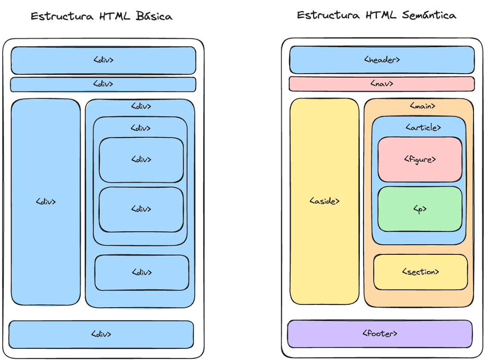

# Semântica

Ao construir páginas da web, usamos uma combinação de HTML não semântico e HTML semântico. A palavra semântico significa "relacionado ao significado", então elementos semânticos fornecem informações sobre o conteúdo entre as tags de abertura e fechamento.

Ao usar HTML semântico, selecionamos elementos HTML com base em seu significado, não em como eles são apresentados. Elementos como `
` e `` não são elementos semânticos, pois não fornecem contexto sobre o que está dentro dessas tags.

Por exemplo, em vez de usar um elemento `
` para conter nossas informações de cabeçalho, poderíamos usar um elemento `<header>`, que é usado como uma seção de título. Ao usar uma tag `<header>` em vez de uma `
`, fornecemos contexto sobre quais informações estão dentro da tag de abertura e fechamento.

Por que usar HTML semântico?

Acessibilidade: O HTML semântico torna as páginas da web acessíveis para dispositivos móveis e também para pessoas com deficiência. Isso ocorre porque leitores de tela e navegadores conseguem interpretar melhor o código.

SEO: melhora o SEO do site, ou Search Engine Optimization, que é o processo de aumentar o número de pessoas que visitam sua página da web. Com um SEO melhor, os mecanismos de busca conseguem identificar melhor o conteúdo do seu site e ponderar o conteúdo mais importante adequadamente.

Fácil de entender: o HTML semântico também torna o código-fonte do site mais fácil de ler para outros desenvolvedores da web.

Para entender melhor isso, você pode pensar em comparar o HTML não semântico a entrar em uma loja sem placas nos corredores. Como os corredores não são etiquetados, você não sabe quais produtos estão nesses corredores. No entanto, as lojas que têm placas para cada corredor tornam muito mais fácil encontrar os itens de que você precisa, assim como o HTML semântico.
